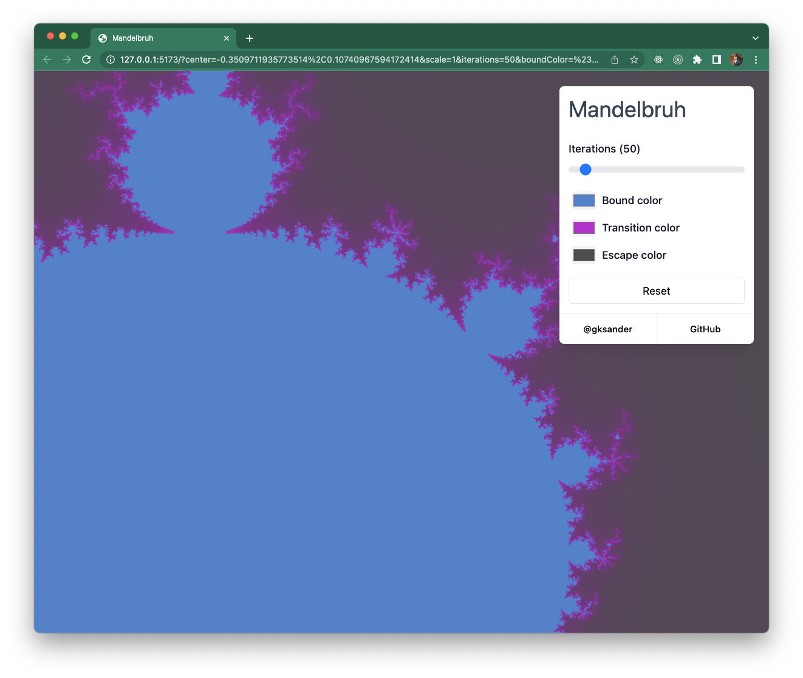

# Mandelbruh

This repo houses the code for [mandelbruh](https://mandelbruh.dev), a Mandelbrot set visualizer built using WebGL and Svelte.



The UI allows you to adjust the number of "iterations" used to determine if a point "escapes". You can also adjust the colors for the visualization Furthermore, you can scroll to zoom, and click-and-drag to pan the view.

## How does it work?

The visualization is powered by WebGL (mostly just shaders), and the UI is powered by Svelte. At a high-level, this is how things work:

- The UI is powered by Svelte, using Svelte stores etc. to manage input values. For example, there's an `iterations` value that can be adjusted in the UI – the value for this is stored in a Svelte store, but is essentially just an integer value.
- There is a WebGL program running inside of a canvas element. The WebGL program render cycle is running on a `requestAnimationFrame` loop, and uses various JS variables/store values that get passed along to WebGL as "uniform values".
- As JS variables/store values are updated, the next animation frame will pick up the value and pass it along to the WebGL context to be used in the next render.

The code for these WebGL shaders can be found in [`src/shaders`](./src/shaders/).In [the `fs.frag`](./src/shaders/fs.frag) file, you'll notice some declarations like:

```glsl
uniform int iterations;
uniform vec2 center;
uniform float scale;
uniform float resolution;
uniform vec3 boundColor;
uniform vec3 transitionColor;
uniform vec3 escapeColor;
```

which are essentially the input variables to the shader process, whose values are provided from the JS side of things.

In [the `FractalDisplay.svelte` file](./src/components/FractalDisplay.svelte) you'll see something like this:

```ts
gl.uniform1f(locations.resolution, width);
gl.uniform1i(locations.iterations, Math.round($iterations));
gl.uniform1f(locations.scale, $scale);
gl.uniform2f(locations.center, $center.x + centerDelta.x, $center.y + centerDelta.y);
gl.uniform3f(locations.boundColor, ...$boundColor);
gl.uniform3f(locations.transitionColor, ...$transitionColor);
gl.uniform3f(locations.escapeColor, ...$escapeColor);
```

These `gl.uniform1f` etc calls are what send our JS values into the WebGL context for our shader to use.
